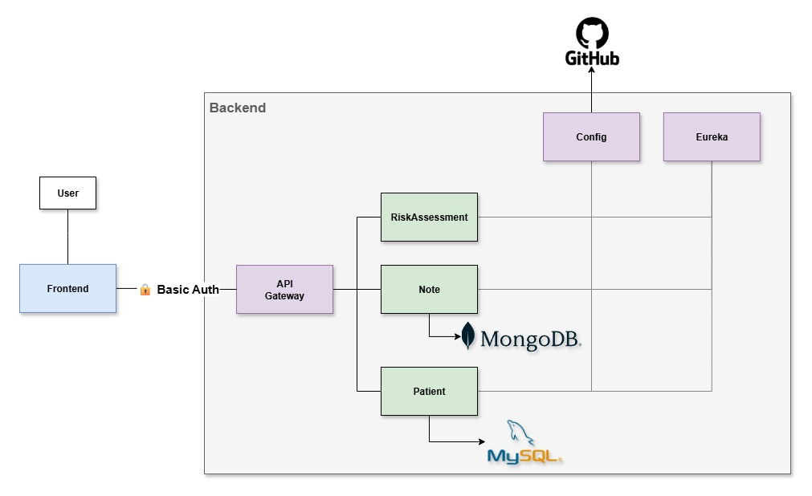

# 🩺 Medilabo Solutions

# 🔍 Project Overview
This project is a medical application designed to manage patient data, store medical notes, and calculate type 2 diabetes risk assessments. 

# 🛠️ Technologies
## Backend
- **Java 21**
- **Spring Boot 3.5.4**
- **Spring Cloud 2025.0.0**
## Databases
- **MySQL 8.0**
- **MongoDB 8.0**
## Build and test tools
- **Maven 3.9.11**
- **JUnit 5**
- **Mockito**
- **JaCoCo**
## Frontend
- **Vite 7.0**
- **React 19.1**
- **TypeScript 5.8.3**
- **HTML5/CSS3**
- **Node.js 22.18**
- **NPM 10.9.3**

# 🏗️ Architecture
This project is built using a **microservices architecture** :  



- **Frontend** (client-ui/frontend:9080) : User interface for the application.  


- **Api Gateway** (ms-gateway:9001) : Handles all API requests and routes them to the appropriate microservice.
  - Spring Cloud Gateway
  - Spring Boot Security (Basic Auth for authentication with the frontend)


- **Patient** (ms-patient:9005) : Manages patient data.
  - Spring Data JPA (MySQL)
  - Spring Boot Actuator (Monitoring)


- **Note** (ms-note:9006) : Manages medical notes.
  - Spring Data MongoDB (MongoDB)
  - Spring Boot Actuator (Monitoring)
  - Spring Cloud OpenFeign (Communication with ms-patient)


- **Risk Assessment** (ms-riskassessment:9007) : Calculates the risk of type 2 diabetes based on patient data.
  - Spring Boot Actuator (Monitoring)
  - Spring Cloud OpenFeign (Communication with ms-patient & ms-note)


- **Config** (ms-config:9003) : Centralized configuration, stored on GitHub, for microservices.
  - Spring Cloud Config Server


- **Eureka** (ms-eureka:9002) : Service discovery for microservices.
  - Spring Cloud Netflix Eureka


# 🚀 Getting Started
The project can be run locally or with Docker.  
Docker is recommended for a quick start, as it simplifies the setup process.

## 🗂️ Project architecture

```properties
cros-paul-Medilabo/
├── 📂client-ui/
│   └── 📂frontend/
├── 📂ms-config/
├── 📂ms-eureka/
├── 📂ms-gateway/
│   └── 📝.env                                # Env (Local mode)
├── 📂ms-note/
│   └── 📝.env                                # Env (Local mode)
├── 📂ms-patient/
│   └── 📝.env                                # Env (Local mode)
├── 📂ms-riskassessment/
├── 📝secrets_ms_config_git_credentials.json  # Git credentials for ms-config (Docker mode)
└── 📝.env                                    # Env (Docker mode)
```
## 📦 Clone the project

```bash
  git clone https://github.com/paulc/cros-paul-Medilabo.git
```
---
## 🐳 Deployment with Docker

### Prerequisites
- Docker
- Docker Compose (2.39.1)

### Installation steps

Update ```.env``` file in the root folder.

```properties
# Activate the Docker profile
SPRING_PROFILES_ACTIVE=docker

# MS-Gateway & Frontend : authentification
MS_GATEWAY_USER=
MS_GATEWAY_PASSWORD=

# MS-Patient : MySQL
MYSQL_USER=
MYSQL_PASSWORD=

# MS-Note : MongoDB
MONGODB_USER=
MONGODB_PASSWORD=
```

Copy the file ```secrets_ms_config_git_credentials.json``` file in the root folder.  
This file has been sent to you by the project manager.

```json
{
  "MS_CONFIG_GIT_URI": "",
  "MS_CONFIG_GIT_USERNAME": "",
  "MS_CONFIG_GIT_PAT": ""
}
```
_Note: This file contains the credentials required to access the Git repository where the microservices configuration files are stored. 
In Docker mode, the ms-config service is essential as the configurations are fetched from the Git repository._

Launch the project from the root directory:
```bash
  # Build the images
  docker-compose build
  # Start the project in detached mode
  docker-compose up -d
  # Stop the project
  docker-compose down
```

Startup order:
- ms-eureka, dbMySQL, dbMongoDB
- ms-config
- ms-note, ms-patient, ms-riskassessment
- ms-gateway
- Frontend

_Note: Startup process uses health checks based on the Spring Boot Actuator (http://.../actuator/health route). 
A virtual private network is established between the edges and microservices; only the frontend and API ports are exposed. 
Databases are persisted between restarts, using Docker volumes._

### 🚀 **Frontend access : [http://localhost:9080/](http://localhost:9080/)**

---

## 🖥️ Deployment without Docker

### Prerequisites
- Java (21)
- Maven (3.9.11)
- MySQL (8.0)
- MongoDB (8.0)
- Node (22.18)
- NPM (10.9.3)

### Installation steps

Create a **MySQL** database with a user and privileges.
```SQL 
CREATE DATABASE medilabo_patient;
CREATE USER 'myuser'@'localhost' IDENTIFIED BY 'mypassword';
GRANT ALL PRIVILEGES ON medilabo_patient.* TO 'myuser'@'localhost';
FLUSH PRIVILEGES;
```

Create a **MongoDB** database with sample data.  
Use the script `medilabo_note/src/main/resources/mongodb-init-local.js` to create the database and insert sample data.
Before running it, set up the username and password, you will need them for microservice ms-note too.
```js
let username = "";
let password = "";
```

Run the script with mongo shell.
```BASH
  mongosh < medilabo_note/src/main/resources/mongodb-init-local.js
```

Updater ```.env``` file in **ms-note** folder, use the same credentials as for the MongoDB database.

Update ```.env``` file in **frontend** folder, specify your credentials.

Update ```.env``` file in **ms-gateway** folder, use the same credentials as for the frontend .env file.

**Start each microservice** from his folder, example: 
```bash
  cd ms-eureka
  mvn spring-boot:run
```
Please follow this order:
1. ms-eureka
2. ms-note, ms-patient, ms-riskassessment
3. ms-gateway

_Note: in manual mode, the ms-config isn't needed because configurations are stored locally (See application-local.properties in corresponding microservice)._ 

Install and start the Frontend: 
```bash
  cd client-ui/frontend/
  # Install dependencies
  npm install
  # Start the frontend
  npm run dev
```

Access the frontend at http://localhost:9080/

---

# 🌱 Green code
Green code is an approach aimed at reducing the environmental impact of software operation.  

**Hardware:** Favor virtual machines, containers, and cloud services to pool resources and lower energy consumption. Choose green hosting providers that use renewable energy and offset their carbon footprint.    
Check if your hosting or website is green:
- https://www.thegreenwebfoundation.org/ 

**Software:** Optimize algorithms to reduce energy consumption and the resources required to run the application. The choice of language also matters: prefer languages and frameworks optimized for performance and energy efficiency.
Tools to analyze and optimize your code:
- SonarQube plugin: https://github.com/green-code-initiative/creedengo-java
- Green IT Analysis: https://addons.mozilla.org/en-US/firefox/addon/greenit-analysis/
- Lighthouse: https://developers.google.com/web/tools/lighthouse

**Network:** Limit network calls, minify scripts and styles, reduce dependencies, and use caching. These practices help reduce bandwidth usage and the load on network infrastructure.
Check if your website is network optimized:
- https://www.webpagetest.org/
- https://pagespeed.web.dev/
